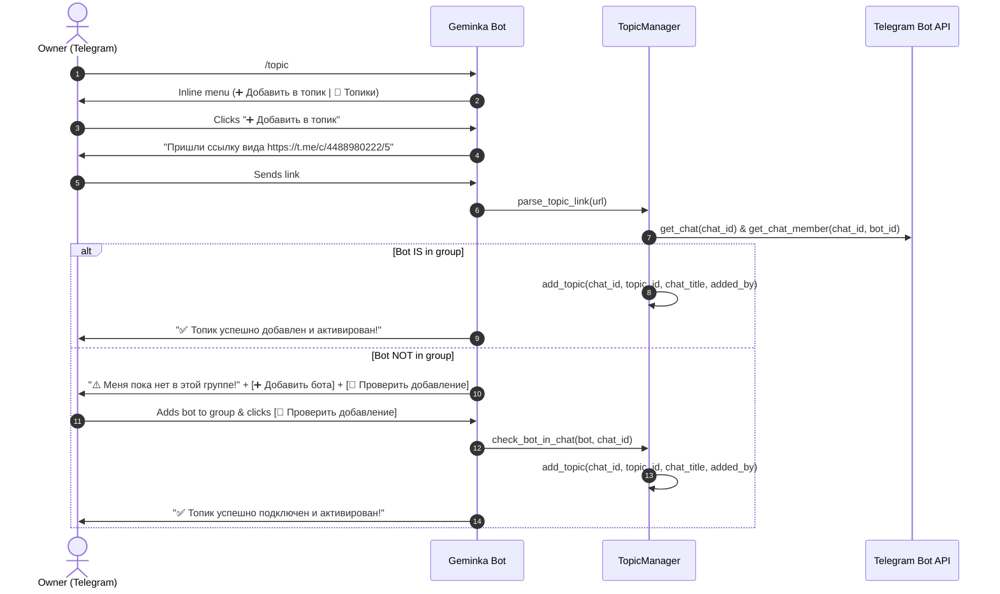

# Telegram Topic & Forum Thread Management Skill

This skill defines the architecture, workflow, and operations for connecting Geminka to specific Telegram forum topics (supergroup threads) and managing active chat routing.

---

## 1. Overview & Architecture

When Geminka is added to a Telegram supergroup with Forums/Topics enabled, it must **not** spam in general or unconfigured threads. It uses targeted routing via `message_thread_id` and the `/topic` management interface.

### Core Components:
- **`app/services/topics.py` (`TopicManager`)**:
  - Manages persistent active topic registry in `data/active_topics.json`.
  - Validates and normalizes internal Telegram topic URLs.
  - Checks bot membership and admin privileges via Telegram Bot API (`get_chat` & `get_chat_member`).
- **`app/bot/handlers.py`**:
  - Interactive FSM-based command `/topic` with Inline Keyboards (`➕ Добавить в топик`, `📑 Топики`, `🗑 Отключить`).
- **`app/bot/middlewares.py` (`OwnerAuthMiddleware`)**:
  - Enforces private chat authorization for allowed users while dynamically allowing group messages strictly within registered active topics.
- **`app/services/streamer.py` (`TelegramStreamConsumer`)**:
  - Routes real-time token streaming, edits, photos, stickers, and reactions precisely into `message_thread_id`.

---

## 2. Supported Link Formats & Parsing Rules

Telegram internal forum links use the format:
```text
https://t.me/c/<chat_num>/<topic_id>
```

### Normalization Logic:
1. Extract `<chat_num>` and `<topic_id>` using regex: `r"t\.me/c/(\d+)/(\d+)"`.
2. Convert `<chat_num>` into a 64-bit Telegram Bot API supergroup `chat_id`:
   - If `<chat_num>` does NOT start with `100`: `chat_id = int(f"-100{chat_num}")`
   - If `<chat_num>` starts with `100`: `chat_id = int(f"-{chat_num}")`
3. Example:
   - Input: `https://t.me/c/4488980222/5`
   - Result: `chat_id = -1004488980222`, `topic_id = 5`

---

## 3. Interactive Connection & Verification Workflow



---

## 4. Message Thread Isolation Rules

1. **Filtering in Groups:**
   - In any `group` or `supergroup`, if `topic_manager.is_topic_active(message.chat.id, message.message_thread_id)` returns `False`, the bot **silently drops** the update.
   - If `True`, the bot treats the message with full persona capabilities (streaming, RP, stickers, emotional engine).

2. **Responses:**
   - Every outgoing message, photo pair, sticker, or reaction MUST specify `message_thread_id=message.message_thread_id`.

---

## 5. Storage Schema (`data/active_topics.json`)

```json
{
  "topics": {
    "-1004488980222:5": {
      "chat_id": -1004488980222,
      "topic_id": 5,
      "chat_title": "Development Discussion",
      "added_by": 1224362805,
      "created_at": 1787723456.0
    }
  }
}
```
